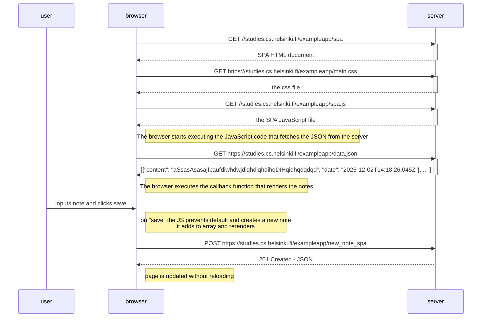

```mermaid

sequenceDiagram
    participant user
    participant browser
    participant server


    browser->>server: GET //studies.cs.helsinki.fi/exampleapp/spa
    activate server
    server-->>browser: SPA HTML document
    deactivate server

    browser->>server: GET https://studies.cs.helsinki.fi/exampleapp/main.css
    activate server
    server-->>browser: the css file
    deactivate server

    browser->>server: GET //studies.cs.helsinki.fi/exampleapp/spa.js
    activate server
    server-->>browser: the SPA JavaScript file
    deactivate server

    Note right of browser: The browser starts executing the JavaScript code that fetches the JSON from the server

    browser->>server: GET https://studies.cs.helsinki.fi/exampleapp/data.json
    activate server
    server-->>browser: [{"content": "aSsasAsasajfbaufdiwhdwjdiqhdiqhdihqDIHqidhqdqdqd", "date": "2025-12-02T14:18:26.045Z"}, ... ]
    deactivate server

    Note right of browser: The browser executes the callback function that renders the notes

    user->>browser: inputs note and clicks save
    Note right of browser: on "save" the JS prevents default and creates a new note <br> it adds to array and rerenders

    browser->>server: POST https://studies.cs.helsinki.fi/exampleapp/new_note_spa
    activate server
    server-->>browser: 201 Created - JSON

    Note right of browser: page is updated without reloading


```